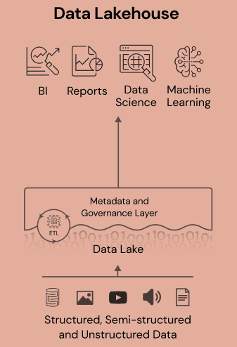

# Architectures for Big Data

Main architectural models used in modern Big Data systems.
The progression from Lambda to Kappa and finally to Lakehouse reflects the evolution in how large-scale data processing pipelines are designed, deployed, and maintained.

---

## Lambda Architecture

*Lambda Architecture*

### Overview

The Lambda Architecture was proposed to address workloads that require:  
- **Low-latency processing** of real-time data streams  
- **Accurate historical analysis** of large datasets  
- **Fault-tolerant distributed storage and computation**  

It splits computation into two separate layers:  
- A **Batch Layer** for comprehensive historical processing  
- A **Speed Layer** for incremental, real-time computation  

The results from both streams are merged in a **Serving Layer**, which exposes data for querying.

### Components

| Layer | Purpose | Typical Technologies |
|------|---------|---------------------|
| **Batch Layer** | Computes results on large historical datasets; stores master dataset | HDFS, Spark, MapReduce |
| **Speed Layer** | Processes streaming data with low latency | Kafka Streams, Apache Flink, Spark Streaming |
| **Serving Layer** | Exposes processed data for queries | Cassandra, HBase, Elasticsearch |

### Workflow

1. Raw data is ingested into distributed storage.  
2. The Batch Layer performs periodic, large-scale recomputations.  
3. The Speed Layer computes incremental updates from real-time streams.  
4. Both views are merged to answer queries.  

### Advantages and Challenges

**Advantages**
- Fault-tolerant by design (historical data always recoverable).  
- Accurate due to full recomputation in the batch layer.  

**Challenges**
- **Code duplication**: logic must be implemented twice.  
- Operational complexity is high.  
- High cost in maintenance and monitoring.  

---

## Kappa Architecture

*Kappa Architecture*

### 2.1 Motivation

Kappa Architecture was introduced as a **simplification** of Lambda Architecture.  
It is based on the idea that:  
> *If all data is a stream, then batch processing becomes unnecessary.*  

This allows the system to use **only one processing model**: streaming.  

### Core Principles

- All data is treated as an **event stream**.  
- A durable **append-only log** acts as the system of record.  
- Stream processors derive real-time and historical views by replaying the log when necessary.  

### Components

| Component | Description | Example Technologies |
|----------|-------------|----------------------|
| **Log Storage** | Stores all events in order | Apache Kafka, Redpanda |
| **Stream Processing Engine** | Processes data in real time | Apache Flink, Kafka Streams, Spark Structured Streaming |
| **Serving Layer** | Stores processed materialized views | Cassandra, Elasticsearch |

### Advantages and Limitations

**Advantages**
- **No duplicated code path** (simpler development).  
- Reprocessing is possible by replaying the event log.  
- Lower operational overhead compared to Lambda.  

**Limitations**
- Requires log storage with long retention policies.  
- Some historical batch workloads may be less efficient than Lambda.  

---

## Lakehouse Architecture

*Lakehouse*

### Background

Traditional **Data Warehouses** enforce strong schema and [ACID](acid.md "ACID") guarantees but are expensive and inflexible.  
**Data Lakes**, in contrast, store raw data cheaply but lack governance, transactional safety, and can degrade into *data swamps*.  

The **Lakehouse Architecture** aims to combine the strengths of both.  

### Core Characteristics

| Feature | Description |
|--------|-------------|
| **Unified Storage** | Uses a Data Lake as the central storage platform (e.g., S3, HDFS). |
| **ACID Transactions** | Enabled through metadata layers such as Delta Lake, Iceberg, or Hudi. |
| **Schema Enforcement + Governance** | Ensures data quality and consistency. |
| **Supports both BI and ML Workloads** | Enables SQL analytics and AI pipelines on the same data. |

### Layered Data Structure

| Layer | Data State | Purpose |
|------|------------|---------|
| **Bronze** | Raw ingested data | Archival + traceability |
| **Silver** | Cleaned and structured data | Reliable analytical base |
| **Gold** | Aggregated business-level data | BI dashboards + ML models |

### Key Technologies

| Component | Technologies |
|----------|--------------|
| **Storage** | AWS S3, Azure Blob, GCS, HDFS |
| **Table Format** | Delta Lake, Apache Iceberg, Apache Hudi |
| **Processing** | Apache Spark, Trino, Databricks, Flink |

### Advantages

- Eliminates duplicate data pipelines.  
- Reduces complexity compared to Lambda/Kappa.  
- Supports machine learning workflows natively.  
- Highly cost-effective when deployed in cloud environments.  

---

## Evolution Summary

| Architecture | Batch | Streaming | Complexity | Best Use Case |
|-------------|-------|-----------|------------|---------------|
| **Lambda** | Yes | Yes | High | Systems requiring historical accuracy and real-time data |
| **Kappa** | No | Yes | Medium | Event-driven and continuous streaming applications |
| **Lakehouse** | Yes | Depends on engine | Medium | Unified environments for BI and ML with governance |

---

[Comparison](comparison.md "Comparison")

[Case Study](case_study.md "Case Study")

