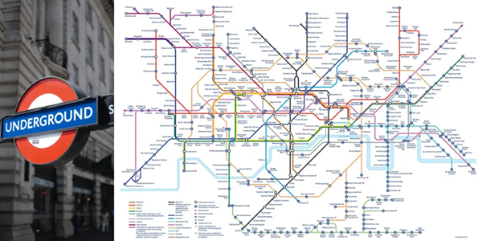

# Applications - Complexity Management

## Application of Matrix Multiplication to Graph Theory

## Introduction

> *"Programming is usually taught by examples" — Niklaus Wirth (1934-2024)*  

## Brief Biography  

Niklaus Wirth was an influential computer scientist, creator of programming languages such as Pascal, Modula, and Oberon. He received the Turing Award in 1984 for his contributions to programming language design and software methodologies. His teaching approach always emphasized the use of practical examples to explain complex concepts.

---

Matrix multiplication plays a crucial role in many [Big Data applications](usesmatrixmultiplication.md), especially when data is modeled as graphs or networks. Graphs allow us to represent and analyze massive, interconnected datasets in areas such as social networks, biological systems, computer networks, and recommendation systems.  
By leveraging matrix multiplication, we can efficiently compute paths, connectivity, influence, and ranking in graphs — operations that are fundamental to large-scale data analysis.  
In Big Data, where datasets may include millions of nodes and billions of connections, matrix-based approaches provide a scalable mathematical framework for tasks such as **link prediction, shortest path discovery, clustering, and random walks**.

---

## Applications of graphs across domains

- **Social Networks**: Nodes represent users, and edges represent friendships or follower relationships.  [Example](social_network.md)
- **Transportation Networks**: Nodes are locations (cities, airports), and edges are routes (roads, flights). [Example](transportation_network.md) 
- **Web Pages**: Nodes are web pages, and edges are hyperlinks between them. [Example](web_pages.md)   
- **Computer Networks**: Nodes are devices, and edges are communication links.  [Example](computer_network.md)   
- **Biological Networks**: Nodes are genes or proteins, and edges are interactions or regulatory relationships.  [Example](biological_network.md)   
- **Recommendation Systems**: Nodes represent users and items, with edges indicating preferences or ratings.  [Example](recommendation_system.md)   
- **Knowledge Graphs**: Nodes represent entities (people, places, things), and edges represent semantic relationships. [Example](knowledge_graph.md)  
- **Scheduling Problems**: Nodes represent tasks, and edges represent dependencies. [Example](scheduling_problem.md) 

---

[Example](additive_vs_multiplicative.md) 

---

### Social Networks

**Efficient Relationship Modelling:** Graphs can naturally represent social connections and quickly identify relationships like mutual friends or groups.  
**Pathfinding:** Algorithms like Breadth-First Search (BFS) can find the shortest path between two people, useful for "degrees of separation."

*Social Network*

### Transportation Networks

**Optimal Path Finding:** Algorithms like Dijkstra's or A(asterisk) can find the shortest or fastest route between locations.  
**Network Analysis:** Graphs make it easy to analyze connectivity (e.g., detecting if certain cities are isolated).

*Transportation Network*

*Transportation Network*

### Web Pages

**Link Analysis:** Algorithms such as PageRank use the graph structure of the web to rank pages based on the number of incoming and outgoing links.  
**Crawling and Indexing:** Graph traversal techniques help search engines crawl the web efficiently.

*This visualization represents the network of web pages connected to voson.anu.edu.au obtained by a web crawl, modified from Fig. 12.9 of the NodeXL Book [27, p. 192].*

### Computer Networks

**Routing Algorithms:** Graphs enable efficient packet routing by finding the shortest path in a network.  
**Failure Detection:** It helps identify potential points of failure and improve the robustness of the network.

*Transportation Network*

*Transportation Network detail*

### Biological Networks

**Pathway Analysis:** Graphs model complex biological pathways, helping to identify critical interactions in gene regulation or protein networks.  
**Community Detection:** Helps identify clusters or communities of related genes or proteins, useful in understanding functional modules.

*Biological Network*

### Recommendation Systems

**User-Item Relationship Modelling:** Graphs can represent complex relationships between users and items, enabling collaborative filtering.  
**Graph-based Ranking:** Algorithms can rank items based on their connections to other highly-rated items.

*Recommendation System Network*

### Knowledge Graphs

**Semantic Search:** Allows for more natural language search by understanding relationships between entities.  
**Reasoning and Inference:** Graph algorithms can help infer new knowledge based on existing relationships.

*Knowledge Graph*

### Scheduling Problems

**Dependency Resolution:** Graphs can represent task dependencies, making it easier to identify the correct order of execution.  
**Cycle Detection:** Can detect circular dependencies that would prevent proper scheduling.

*Tasks Graph representation*

---

<!--[Application Graph Extended](applications_graphs_extended.md)-->

 Graph analisys

Besides paths and influence, graph analysis usually includes:

 <strong>Communities</strong> (natural groups)

 <strong>Centrality</strong> (ways of measuring importance)

 <strong>Anomalies</strong> (detecting unusual nodes)

 <strong>Temporal evolution</strong> (network dynamics)

 <strong>Diffusion/propagation</strong> (information, viruses, etc.)

 <strong>Patterns and motifs</strong> (recurring local structures)

 <strong>Matching</strong> (users–items, resources–tasks)

 <strong>Robustness</strong> (what happens if nodes/edges fail)

[Exercises](graphs_exercises.md)
