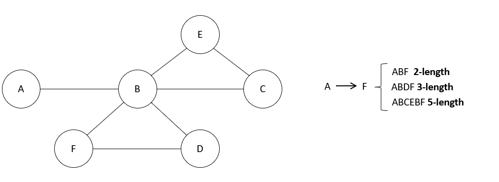
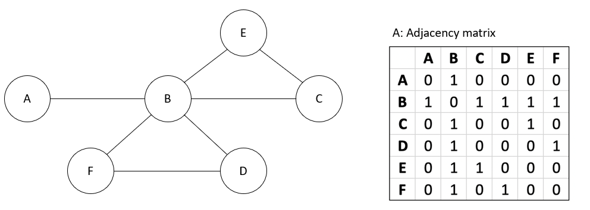
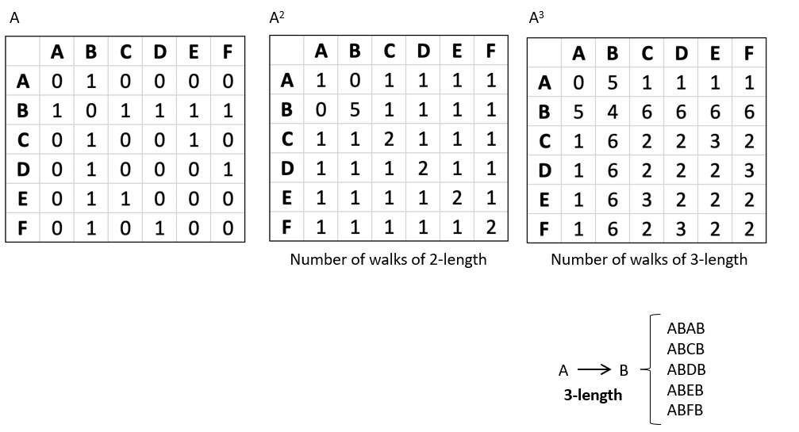

# Length of Paths

In graph theory, one of the most interesting questions we can ask is: *How many different ways are there to go from one node to another in exactly k steps?*  
This concept is fundamental in Big Data applications, where we often want to explore connectivity in very large networks such as social graphs, transportation systems, or biological networks.

The tool that allows us to answer this question is the **adjacency matrix** of a graph and its powers. By multiplying the adjacency matrix by itself, we can discover not just direct connections, but also paths of longer lengths.

---

## Explanation
- Let **A** be the adjacency matrix of a graph with nodes \( V = \{v_1, v_2, ..., v_n\} \).  
- The entry \( A_{ij} = 1 \) if there is an edge from node \( v_i \) to node \( v_j \), and 0 otherwise.  
- When we compute \( A^2 \), the entry \( (A^2)_{ij} \) gives the **number of paths of length 2** between \( v_i \) and \( v_j \).  
- More generally, \( (A^k)_{ij} \) tells us the number of paths of length *k* from \( v_i \) to \( v_j \).  

This makes adjacency matrix powers a very powerful tool for analyzing networks in Big Data: with a single matrix operation we can count millions of possible connections!

---

## Example
Consider a small graph with 6 nodes: A, B, C, D, E, F. Suppose we want to know the number of different paths from **A to F**.

- **1-step path**: directly from A to F (if the edge exists).  
- **2-step path**: A → B → F.  
- **3-step path**: A → B → D → F.  
- **5-step path**: A → B → C → E → B → F.  

Mathematically, these are obtained from the adjacency matrix **A**:
- From **A** itself, we see all direct edges (paths of length 1).  
- From **A²**, we get all paths of length 2.  
- From **A³**, we get all paths of length 3.  

This illustrates how matrix multiplication helps us uncover paths of arbitrary length in a graph, which is extremely useful for analyzing reachability in large-scale networks.

💡 Specific problem:

  Detecting users that can be influenced in a limited number of steps.

Suppose a user A publishes an information (news, rumour or advertising product), and we want to know which users can be reached through interactions in exactly n steps. For example, we want to see who could receive the information if it is shared among friends up to three times (i.e. in paths of length 3). 

---

# Repeated Squaring and Complexity

To compute shortest paths efficiently in large networks, we need more than a naive approach.  
**Repeated squaring** is a powerful method that reduces the number of computations while still giving us exact results.

---

## Explanation
- The idea: instead of computing powers sequentially, we square the matrix repeatedly.  
- Formally:  
  - \( W^2 = W \otimes W \) (using min-plus multiplication).  
  - \( W^4 = W^2 \otimes W^2 \).  
  - Continue until \( W^{2^{\lceil \log(n-1) \rceil}} \).  
- This algorithm has a time complexity of \( O(n^3 \log n) \), which is much more efficient than naive approaches for large graphs.

---

## Example
For a given weight matrix **W**, repeated squaring allows us to quickly discover shortest paths between all pairs of nodes, even in very large networks.

---

ag_4, ag_5 y ag_6

---

# Random Walks and Markov Chains

Sometimes, we are not interested in deterministic paths but in **probabilistic movement** across a network.  
This is where **random walks** and **Markov chains** come into play, both of which can be described using matrix multiplication.

---

## Explanation
- A **random walk** is a process where, at each step, we move to a random neighbor of the current node.  
- This can be represented by a **transition matrix T**, where each entry \( T_{ij} \) gives the probability of moving from node i to node j.  
- By computing \( T^n \), we find the probabilities of being in each node after n steps.  
- Over time, this leads to a **stationary distribution**, which tells us the long-term behavior of the system.

This framework is fundamental in PageRank, recommendation systems, and modeling diffusion in social and biological networks.

---

## Example
Consider a graph with nodes A–F. The transition matrix **T** encodes the probability of moving between nodes.  
- If we start at node A and compute \( T^n \) for a large n, we obtain a vector that represents the probability of being at each node after many steps.

---

ag_7

---
# Case Study: Casino Random Walk

To better understand random walks, let’s look at a simple but illustrative example: the casino.  

---

## Explanation
- Imagine a player who always bets $1.  
- The probability of winning or losing is equal.  
- This can be modeled as a random walk on a **line graph**, where each node represents the player’s wealth at a given time.  
- As the game evolves, the player’s wealth moves left (loss) or right (win) along the line.  

This model allows us to study important aspects of the game, such as the probability distribution of the player’s wealth after a certain number of bets, or the risk of eventual ruin.

---

ag_8

---