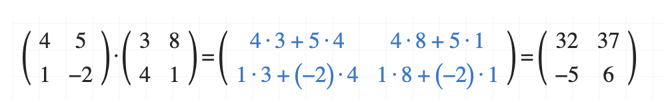
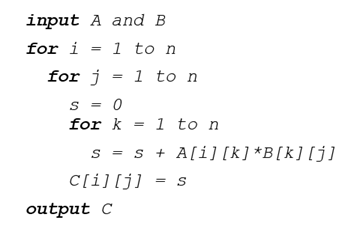

# Experiments – Complexity Management

---

## Introduction

> *“There are a lot of ways known to do it wrong and which one is right is not clear.”*  
— James Gosling (1955–)

## Brief Biography  
James Gosling, born on May 19, 1955, in Calgary, Canada, is a computer scientist widely known as the “father of Java.” He studied computer science at the University of Calgary and later earned a Ph.D. in computer science from Carnegie Mellon University. Gosling joined Sun Microsystems in the 1980s, where he led the development of the Java programming language, officially released in 1995. Java quickly became one of the most influential programming languages in the world due to its portability, security, and “write once, run anywhere” philosophy. Beyond Java, Gosling has contributed to compiler design, operating systems, and software development tools. He has worked at several leading technology companies, including Sun Microsystems, Oracle, Google, and Amazon Web Services.

## The Creation of Java  
In the early 1990s, Gosling and his team at Sun Microsystems initiated the “Green Project” to develop a language suitable for consumer devices and embedded systems. Gosling designed Java with a strong emphasis on simplicity, object-oriented design, memory management, and platform independence. The language introduced features like automatic garbage collection and a virtual machine (the JVM) that allowed programs to run across different hardware and operating systems. Java’s release in 1995 revolutionized programming by becoming the backbone of enterprise applications, web development, and later Android applications. Today, Java remains one of the most widely used and enduring programming languages, a testament to Gosling’s vision and leadership.

Complexity in computation is not only about algorithms but also about **implementation choices**, **programming languages**, and **hardware utilization**.  
This experiment explores **matrix multiplication** as a case study to analyze performance differences across programming languages and approaches.

---

## Reminder: Matrix Multiplication

If **A** and **B** are `n × n` matrices, their product **C = AB** is also an `n × n` matrix. Each element of the resulting matrix is obtained by combining a row of **A** with a column of **B**.

Formally:

\[
C[i,j] = \sum_{k=1}^n A[i,k] \cdot B[k,j]
\]

This operation is fundamental in scientific computing, graphics, and machine learning, but it is also **computationally intensive**, requiring **O(n³)** operations in its naïve form.

---

## Algorithm (Naïve Approach)

Pseudocode of the classic algorithm:

### Python ###

 **[Python Example](codigos.md#python)**

Running time 409.45 seconds with 1024 x 1024 matrices

### Rust ###

 **[Rust Example](codigos.md#rust)**

Running time 7.91 second with 1024 x 1024 matrices

### Java ###

 **[Java Example](codigos.md#java)**

Running time 7.76 seconds with 1024 x 1024 matrices
52x faster than python

### C ###

 **[C Example](codigos.md#c)**

Running time 0.677867 seconds with 1024 x 1024 matrices

11x faster than java

### TIOBE Programming Community Index ###

The image represents the TIOBE Programming Community Index, which measures the relative popularity of programming languages over time. It does not indicate the best language but rather the most used and most visible in the global developer community, based on search engines, courses, and vendors.

💡 Details

<strong>Java (green):</strong> Dominated the early 2000s with more than 25% share but has steadily declined, although it remains highly relevant.

<strong>C (black):</strong> Extremely stable and consistently strong, often alternating with Java in the top positions.

<strong>Python (light blue):</strong> Shows explosive growth after 2015, becoming the most popular language since 2020. This reflects the rise of data science, machine learning, and artificial intelligence.

<strong>C++ (orange):</strong> Popular in the early 2000s, now stabilised at around 8–10%.

<strong>C# (dark blue):</strong> Grew quickly with the .NET ecosystem in the 2000s and maintains a solid mid-level share.

<strong>PHP (aqua):</strong> Very popular in web development between 2005–2010 but declined as JavaScript frameworks and other technologies took over.

<strong>JavaScript (yellow):</strong> Maintains a stable share, though its dominance in web applications is not fully reflected in TIOBE’s methodology.

<strong>Other languages (SQL, Assembly, Visual Basic, etc.):</strong> Remain present in niche applications.

💡 Conclusions

<strong>C and Java</strong> were the long-time leaders of the programming world.

<strong>Python’s meteoric rise</strong> illustrates how industry trends (AI, data analytics) can change the landscape of programming.

The index shows that <strong>language popularity evolves with technological needs</strong>, and students should be aware of both long-standing and emerging languages.

---

## EXERCISE 1 Complexity Experiment
Given the matrix multiplication algorithm, how would you optimize the storage and management of the input data to improve the efficiency of the computation? Consider both memory access patterns and the use of specialized data structures.

[Solution](Exercise1_Complexity.pdf)

---

## Benchmarking in Complexity Management

**Benchmarking** is the methodology of comparing processes with respect to specific performance measures such as **execution time, memory usage, throughput, or scalability**.  

It allows us to:
- Evaluate performance under different conditions.  
- Compare technologies and frameworks.  
- Identify bottlenecks in computation.  
- Optimize resources.  
- Ensure scalability as systems and data grow.  

The benchmarking process generally follows **three key steps**:

1. **Setup the experiment**: Define datasets, algorithms, and parameters.  
2. **Execution**: Run tests under controlled conditions.  
3. **Analysis**: Interpret results, compare metrics, and extract insights.  

---

## Case Study Examples

### 1. Performance Evaluation

Imagine a company processing large datasets in real time for **fraud detection**.  
Using a framework such as **Apache Spark**, benchmarking helps measure **how many transactions per second** the system can handle before latency increases.  
This determines the optimal configuration to maintain performance while minimizing delays.

💡 Proposal

Here’s a real-world case where benchmarking helps: fraud detection with Spark.

If the system starts to show latency at 50,000 transactions per second, what changes could you propose to improve performance?

💡 Reflexion

If the system shows latency at 50,000 transactions per second, you could improve performance by:

<strong> Scaling horizontally</strong> → add more nodes or executors to increase parallelism.

<strong> Optimizing resources</strong> → tune memory and CPU allocation.

<strong> Partitioning the data stream</strong> → add more Kafka/Spark partitions for better distribution.

<strong> Reducing state size</strong> → use watermarks or windowing to avoid unbounded memory growth.

<strong> Optimizing the code</strong> → avoid unnecessary shuffles and use efficient libraries.

In summary, the goal is to increase parallelism, make better use of resources, and control state growth, so the system can process more transactions without adding latency.

### 2. Technology Comparison

A research team compares **Apache Hadoop** and **Apache Flink** for batch processing.  
- Hadoop: More efficient for massive, distributed storage and processing.  
- Flink: Better for real-time analytics.  
Benchmarking on workloads like **social media data** helps them select the best tool.

💡 Proposal

This is an example of how benchmarking guides technology choice: Hadoop vs Flink.

If you had to process social media streams, which system would you benchmark and why?

💡 Reflexion

If I had to process social media streams, I would benchmark Apache Flink because it is optimized for real-time and low-latency stream processing. Hadoop is more efficient for large-scale batch processing, but social media data requires continuous analysis, so Flink would likely perform better for this use case.

### 3. Resource Optimization

In cloud environments, resources are billed by usage.  
Benchmarking reveals how different **CPU/memory configurations** affect the runtime of machine learning tasks.  
For example, doubling memory but keeping CPU constant may cut processing time by half — optimizing cost-performance balance.

💡 Proposal

This is how benchmarking can guide resource allocation in cloud environments.

If doubling memory halves the processing time, would you consider it cost-effective even if memory is twice as expensive as CPU?

💡 Reflexion

In order to process social media streams, maybe benchmark Apache Flink is a good choice because it is optimized for real-time and low-latency stream processing. Hadoop is more efficient for large-scale batch processing, but social media data requires continuous analysis, so Flink would likely perform better for this use case.

### 4. Identifying Bottlenecks

In ETL (Extract, Transform, Load) workflows, benchmarking can reveal **network transfer speed** as the bottleneck between Amazon S3 and Hadoop clusters.  
This insight guides investment in better infrastructure or alternative transfer methods.

💡 Proposal

Benchmarking can reveal whether the bottleneck lies in the network rather than in storage or compute.

If your ETL pipeline is slow, how would you use benchmarking to determine whether the problem is CPU, storage, or network?

💡 Reflexion

To identify bottlenecks in an ETL pipeline, I would run benchmarks that measure the performance of each stage separately—data transfer, storage, and processing. If the results show that network transfer between storage (e.g., S3) and the processing engine (e.g., Hadoop) is significantly slower than computation or storage access, then the network is the bottleneck. This insight helps decide whether to improve network capacity or adjust data transfer methods.

### 5. Ensuring Scalability

An online retailer analyzing customer behavior starts with 1M transactions but expects exponential growth.  
Scalability benchmarks test workloads of 10M, 50M, or 100M transactions to ensure the system scales **without performance degradation**.

💡 Proposal

Scalability benchmarking helps companies anticipate growth and ensure that performance remains stable as data volume increases.

If your dataset grew 100 times larger, how would you benchmark your system to check whether it can scale without performance degradation?

💡 Reflexion

To benchmark scalability, the dataset size can be gradually increased (e.g., 10x, 50x, 100x) while measuring how the system’s performance changes. If the system maintains acceptable response times and throughput as the data grows, then it scales effectively. Otherwise, the benchmark highlights where improvements in infrastructure or algorithms are required.

---

## EXERCISE 2 Complexity Experiment
Execute the algorithms associated to different methods or programming languages with different datasets (size of the matrix) and extract measures (execution time).

---

## Optimizing Matrix Multiplication

Students are expected to:
1. **Implement algorithms** for matrix multiplication (naïve and optimized).  
2. **Execute them** in different languages or frameworks (e.g., Python, Java, C, Rust).  
3. **Vary dataset size** (matrix dimension) and record metrics (execution time, memory usage).  
4. **Compare results** across methods.  
5. **Draw conclusions** about efficiency, scalability, and hardware utilization.

---

*Comparison of common time complexities (Big-O). The graph shows how algorithm performance scales with input size, from constant time O(1) to exponential O(2^n), highlighting the dramatic differences in growth rates.*

## Documenting Benchmarks

When reporting experiments, follow a structured format:

**Title**  
- Clear and concise, e.g. *Benchmarking Matrix Multiplication Algorithms on Big Data Platforms*.  

**Abstract**  
- Briefly state the **task**, algorithms compared, performance measures, and conclusions.  

**Body**  
- Describe **setup, methodology, datasets, and tools**.  
- Provide tables or charts (execution times, speedups, scalability curves).  

**Conclusions**  
- Summarize key findings.  
- State **recommendations** for future research or practice.  

**Example Abstract:**  
We study the behavior of several matrix multiplication algorithms used for large-scale computation. We analyze execution time, memory usage, and scalability. Our experiments provide a reproducible benchmark across a variety of datasets to guide future research in Big Data performance engineering. Based on our results, we recommend combining optimized libraries (BLAS, MKL) with GPU acceleration for the most efficient solutions.

---

*[Scientific Papers](scientificpapers.md)*

