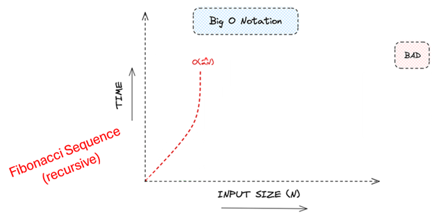

# Lectures - Complexity Management

---

## Introduction

> *Programmers are always surrounded by complexity; we cannot avoid it.*  
— Tony Hoare (1934–)

## Brief Biography  
Charles Antony Richard Hoare, known as Tony Hoare, was born in Colombo (Sri Lanka, then Ceylon) in 1934. Originally studying Classics at Oxford, he later turned to mathematics and computer science, becoming one of the most influential figures in programming languages and algorithms. In 1960, he created **Quicksort**, one of the most widely used and efficient sorting algorithms. Hoare worked on compiler design, programming language theory, and software verification. He was a professor at the University of Oxford and later a principal researcher at Microsoft Research. In recognition of his contributions, he received the ACM Turing Award in 1980.

## Null References – The "Billion-Dollar Mistake"  
In 1965, while designing the programming language **ALGOL W**, Tony Hoare introduced the concept of **null references** (or null pointers) as a way to indicate the absence of a value in reference variables. Decades later, he admitted this design decision was a serious error, calling it his **"billion-dollar mistake"**, since null references have caused countless errors, system crashes, vulnerabilities, and financial losses across the software industry. Hoare discussed this in a 2009 talk at QCon London, reflecting on the immense cost of null-related bugs. Modern programming languages such as Kotlin, Swift, and Rust have since introduced explicit type systems that differentiate between nullable and non-nullable values, reducing the risk of null pointer exceptions and improving software reliability.

---

## BiG O

## Big O
The order of complexity in algorithms is a way to measure an algorithm's efficiency in terms of time and/or space as the input size grows. This measure is expressed using Big O notation, which provides a way to describe the asymptotic behaviour of the algorithm, meaning how it behaves when the input becomes very large.

### Types of Complexity  

- **Time Complexity**: Measures the execution time of the algorithm based on the input size *n*. It focuses on how many operations the algorithm performs as the input size increases.  
- **Space Complexity**: Measures the amount of memory an algorithm needs as a function of the input size *n*.  

## Big O Notation
Big O notation describes the worst-case scenario, representing the upper limit of time or space required as *n* grows. 

 Details

Also called Landau's symbol, is a symbolism used in complexity theory, computer science, and mathematics to describe the asymptotic behavior of functions.

German mathematician Edmund Landau, who was one of the first to use this type of notation in mathematical analysis, to describe the behaviour of mathematical functions when they tend to infinity.

## O(1)
**O(1): Constant.**  
The execution time does not change with the size of the input.  
*Example*: Print a message. 

 Details

Constant time complexity (O(1)) because the execution time of the System.out.println statement is independent of the input size.

## O(1)
**O(1): Constant.**  
Why is it “print a message” O(1)?  
Because the execution time of the `System.out.println` statement is independent of the input size.  

 Details

Constant time complexity (O(1)) because the execution time of the System.out.println statement is independent of the input size.

## O(log n)
**O(log n): Logarithmic.**  
The execution time grows logarithmically as the input size increases.  
*Example*: Binary search. 

 Details

For an array of size n = 1,000,000, binary search will take roughly log⁡2(1,000,000)≈20 comparisons to find the target.

## O(log n)
**O(log n): Logarithmic.**  
Why is “binary search” O(log n)?  
Because at each step, it halves the search space. So, if you double the size of the array, the number of steps required to find an element increases only by 1 (since log₂(2n) = log₂(n) + 1).  

 Details

Logarithmic Growth: Binary search is logarithmic because at each step, it halves the search space. So if you double the size of the array, the number of steps required to find an element increases only by 1 (since log⁡2(2n)=log⁡2(n)+1\log_2(2n) = \log_2(n) + 1log2​(2n)=log2​(n)+1).

For example:

 - For an array of size 1,000,000, binary search requires about 20 comparisons.

 - For an array of size 2,000,000, it requires 21 comparisons.

 - Even though the input size doubled, the time to search increased by only a single step, which is characteristic of logarithmic growth.

## O(n)
**O(n): Linear.**  
The execution time grows proportionally with the input size.  
*Example*: Iterating through an array.

## O(n)
**O(n): Linear.**  
Why is “iterating through an array” O(n)?  
The for loop iterates exactly *n* times. The number of operations (iterations) grows linearly with the input size.  
If *n* = 1,000,000 (or 2,000,000) the loop runs 1,000,000 (2,000,000) times.  

 Details

 <strong>Why is This O(n) Linear Time Complexity?</strong>

In this example, the for loop runs exactly n times, which means the number of iterations grows linearly with the input size n.

For example:

 - If n = 10, the loop runs 10 times.

 - If n = 1000, the loop runs 1000 times.

 - If n = 1,000,000, the loop runs 1,000,000 times.

O(n) means that the execution time of the algorithm is proportional to the size of the input. If you double the size of the input (n), the time to complete the loop will approximately double as well.

So, if it takes 1 second to run 1,000,000 iterations, it will take roughly 2 seconds to run 2,000,000 iterations (assuming constant factors like hardware performance stay the same).

## O(n log n)
**O(n log n): Linear-logarithmic.**  
Common in sorting algorithms like Merge Sort and Heap Sort.  
*Example*: Sorting (Merge Sort).  

## O(n log n)
**O(n log n): Linear-logarithmic.**  
Why is sorting (merge sort) O(n log n)?  

 Details

 <strong>Why is this O(n log n)?</strong>

Sorting an array of n elements using efficient algorithms like Merge Sort or Timsort takes O(n log n) time:

 - The array is divided into smaller subarrays recursively (halving the array size at each step), which takes logarithmic time O(log⁡n)O(\log n)O(logn).

 - Merging the sorted subarrays takes linear time O(n)O(n)O(n) because every element needs to be checked at least once.

 - Therefore, the overall time complexity is O(n \log n).

Example:

For an array of size 100,000, the time complexity would be proportional to:

 - n=100,000n = 100,000n=100,000.

 - log⁡n=log⁡2100,000≈16.61\log n = \log_2 100,000 \approx 16.61logn=log2​100,000≈16.61

 - So, the number of operations would be proportional to 100,000×16.61≈1,661,000100,000 \times 16.61 \approx 1,661,000100,000×16.61≈1,661,000 operations.

## O(n²)
**O(n²): Quadratic.**  
The execution time is proportional to the square of the input size (e.g., sorting algorithms like Bubble Sort or Selection Sort).  
*Example*: Bubble sort. 

## O(n²)
**O(n²): Quadratic.**  
Why is Bubble Sort O(n²)?  

 Details

 <strong>Why is Bubble sort O(n²)?</strong>

The Bubble Sort algorithm has two nested loops: one that iterates over the array and another that iterates over the unsorted part of the array to compare and swap adjacent elements.

 The outer loop runs n times, and for each iteration of the outer loop, the inner loop also runs n times. This leads to a total of n×n=n² operations. In simple terms, as the input size n grows, the time it takes to sort the array grows quadratically. 

For example:

 - If n = 1000, the algorithm performs approximately 1000×1000=1,000,0001000 \times 1000 = 1,000,0001000×1000=1,000,000 operations.

 If n = 2000, the algorithm performs approximately 2000×2000=4,000,0002000 \times 2000 = 4,000,0002000×2000=4,000,000 operations.

## O(n³)
**O(n³): Polynomial.**  
The runtime of the algorithm increases cubically as the input size grows.  
*Example*: Matrix Multiplication (Triple Nested Loops).

## O(n³)
**O(n³): Polynomial.**  
Why is Matrix Multiplication O(n³)? 

 Details

 <strong>Why is This O(n³)?</strong>

Triple Nested Loops: The three nested loops each iterate n times:

 - The outer loop iterates over the rows of matrix AAA. 

 - The middle loop iterates over the columns of matrix BBB.

 - The inner loop computes the dot product for each element of the result matrix.

The total number of iterations is n×n×n=n^3, which is why the algorithm has O(n³) time complexity.

Example:

 - If n = 100, the algorithm performs approximately 100×100×100=1,000,000100 \times 100 \times 100 = 1,000,000100×100×100=1,000,000 operations.

 - If n = 200, the algorithm performs approximately 200×200×200=8,000,000200 \times 200 \times 200 = 8,000,000200×200×200=8,000,000 operations.

 As n increases, the number of operations grows very quickly, which reflects the cubic nature of the time complexity.

## O(2ⁿ)
**O(2ⁿ): Exponential.**  
The execution time doubles with each increase in the input size, common in brute force problems.  
*Example*: Fibonacci Sequence (recursive). 

## O(2ⁿ)
**O(2ⁿ): Exponential.**  
Why is Fibonacci Sequence O(2ⁿ)? 

 Details

 <strong>Why is this O(2ⁿ)?</strong>

The total number of calls for fib(n) is close to 2^n, which is why the time complexity is O(2ⁿ).

Formal Reason:

 The recurrence relation that describes the time complexity is: 

 T(n)=T(n−1)+T(n−2)+O(1) 

This recurrence reflects the fact that each call to fib(n) involves two recursive calls: fib(n - 1) and fib(n - 2). The solution to this recurrence is O(2^n), which means the number of recursive calls grows exponentially with n.

## O(n!)
**O(n!): Factorial.**  
Extremely inefficient, grows very quickly, seen in permutation and combinatorial problems.  
*Example*: Permutation Generation. 

## O(n!)
**O(n!): Factorial.**  
Why is Permutation Generation O(n!)? 

 Details

 <strong>Why is Permutation Generation O(n!)?</strong>

 - For every element in the list, we generate all permutations of the remaining elements.

 - This results in a recursive process where the time complexity grows factorially as the size of the list increases.

 - The number of possible permutations of a list of n elements is n!, which means that the time complexity of generating all permutations is O(n!).

Example:

 For a list of 5 elements ({1, 2, 3, 4, 5}), there are 5!=1205! = 1205!=120 possible permutations. The function generates all 120 permutations and measures how long this process takes.

 If you increase the number of elements to 6, the number of permutations increases to 6!=7206! = 7206!=720. For 7 elements, it becomes 7!=5,0407! = 5,0407!=5,040, and so on. The execution time grows factorially with the size of the input list.

## Big O
Big O notation describes the worst-case scenario, representing the upper limit of time or space required as *n* grows.

**[Exercises](bigO_exercises.md)**
