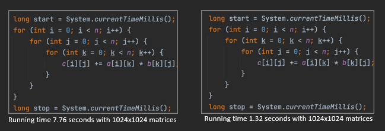

# Experiments – Monitoring and Performance Engineering

---

## Introduction

> *"Programming is an attempt to capture the uniformity of values and processes in actors."*  
> — Robin Milner (1934–2010)

## Brief Biography  

Robin Milner was a British computer scientist renowned for his foundational contributions to programming language theory and formal methods. He developed the ML programming language, one of the earliest to feature type inference and functional programming constructs that influenced modern languages such as Haskell, OCaml, and F#. Milner also created the π-calculus, a formal model for describing concurrent systems, and made pioneering advances in theoretical computer science related to polymorphism and process calculi. He was a professor at the University of Edinburgh and a fellow of the Royal Society. In 1991, he received the Turing Award for “three distinct and complete achievements: LCF, ML, and CCS,” which laid the groundwork for much of modern programming language design and verification.  

## Performance Engineering

Performance engineering focuses on understanding and improving how programs execute. It is not only about making code work correctly, but also about ensuring it runs efficiently and scales well. This section explores experimental insights into performance monitoring, optimization, and computational efficiency.

---

### Measuring Performance

Performance can be measured by analyzing execution time under different computational setups. Consider the case of multiplying two 1024×1024 matrices:

- **Case A:** Running time = 1.32 seconds  
- **Case B:** Running time = 7.76 seconds 

[Matrix Multiply Slow](/Codes/MatrixMultiplySlow.java)  
[Matrix Multiply Fast](/Codes/MatrixMultiplyFast.java)

The only difference between the two implementations is the **loop order**. This affects how memory is accessed, leading to variations in performance by a factor of up to six. Such behavior arises from **data locality**, a key concept in performance analysis.  

Data that is accessed consecutively tends to remain in fast memory (cache), resulting in quicker computations. When data is scattered, cache performance degrades, leading to slower execution.

---

### Cache Optimization

Cache memory provides rapid access to frequently used data. When a requested piece of data is already in cache, a **cache hit** occurs, which is fast. Otherwise, a **cache miss** forces the processor to retrieve data from slower main memory.

To optimize cache usage:  
- Reorganize computations to reuse data already loaded into cache.  
- Access memory in sequential order whenever possible.  
- Choose data structures that map efficiently to cache lines.  

Even small changes in loop nesting or traversal order can significantly improve performance without altering the algorithm itself.

[Matrix Multiply Blocked (or Tiling)](/Codes/MatrixMultiplyBlocked.java)  

This implementation demonstrates cache blocking (or tiling), which improves performance by maximizing cache reuse.
---

### Algorithmic Optimization

Optimization is also achieved through algorithm design. For instance, matrix multiplication can be performed using algorithms with lower theoretical complexity:

- **Strassen algorithm:** (O(n^{2.807}))  
- **Coppersmith–Winograd algorithm:** (O(n^{2.376}))  
- **Optimized CW-like algorithms:** (O(n^{2.373}))

These methods, often called *galactic algorithms*, are mainly of theoretical interest since they are rarely used in practical systems. Nonetheless, they illustrate the boundaries of what is computationally possible.

  
<strong>Algoritmo de Strassen</strong>

  <h3>Contexto</h3>
  

    La multiplicación clásica de dos matrices <em>A</em> y <em>B</em> de tamaño <em>n×n</em> requiere:
  

  <pre><code>O(n^3)</code></pre>
  

    operaciones (exactamente <code>n^3</code> multiplicaciones y <code>n^3 − n^2</code> sumas).
  

  

    Strassen demostró que no era necesario realizar tantas multiplicaciones y que se podía mejorar la complejidad algorítmica.
  

  <h3>Idea básica del algoritmo</h3>
  
Para dos matrices <code>2×2</code>:

  <pre><code>A = [[a, b],
     [c, d]]

B = [[e, f],
     [g, h]]</code></pre>

  
La multiplicación clásica necesita 8 multiplicaciones.

  
Strassen descubrió una forma de calcular el producto usando solo 7 multiplicaciones (y más sumas/restas):

  <pre><code>M1 = (a + d) (e + h)
M2 = (c + d) e
M3 = a (f − h)
M4 = d (g − e)
M5 = (a + b) h
M6 = (c − a) (e + f)
M7 = (b − d) (g + h)</code></pre>

  
Luego, el resultado <code>C = A × B</code> se obtiene como:

  <pre><code>C11 = M1 + M4 − M5 + M7
C12 = M3 + M5
C21 = M2 + M4
C22 = M1 − M2 + M3 + M6</code></pre>

  <h3>Eficiencia</h3>
  
Si se aplica recursivamente a matrices grandes, dividiéndolas en submatrices, la complejidad pasa de:

  <pre><code>O(n^3)  →  O(n^{log2(7)}) ≈ O(n^{2.81})</code></pre>
  
Esto fue un avance enorme, porque por primera vez se demostró que la multiplicación de matrices podía hacerse en menos de tiempo cúbico.

  <h3>Implicaciones prácticas</h3>
  <ul>
    <li>Strassen es más rápido para matrices grandes, pero requiere más memoria.</li>
    <li>Introduce más operaciones de suma/resta, lo que puede aumentar los errores numéricos en cálculos con coma flotante.</li>
    <li>En la práctica, los algoritmos modernos (como Coppersmith–Winograd o algoritmos híbridos) solo aplican Strassen a partir de cierto tamaño de matriz.</li>
  </ul>

  <h3>Ejemplo numérico simple</h3>
  

    Si multiplicas dos matrices <code>4×4</code>, puedes dividirlas en 8 submatrices
    <code>2×2</code> y aplicar Strassen recursivamente. De este modo, se reducen multiplicaciones,
    aunque aumentan las sumas.
  

---

### Density and Sparsity

In many applications, data structures like matrices are mostly empty. **Density** measures the proportion of non-zero elements, while **sparsity** measures the proportion of zeros.

For example, a 6×6 matrix with 9 non-zero elements has:  

 Density = 9/36 = 25%,  Sparsity = 75%.

Real-world matrices often have extremely low densities (e.g., 0.0003% or 2.31%). Managing such sparse data efficiently requires specialized compression techniques.

**Example running times for 1024×1024 matrices:**

| Density | Time (seconds) |
|----------|----------------|
| 0.1%     | 0.02           |
| 1%       | 0.08           |
| 2%       | 0.14           |
| 3%       | 0.23           |

As density increases, the amount of computation and storage requirements grow proportionally.

[Dense vs CRS](/Codes/DenseVsCSRSquare.java)  

 Runing times test

  
<strong>Correction:</strong> The checksums are identical and the max error is 0 &rarr; both implementations compute the same result. 100%

  
<strong>Performance:</strong> With <code>n = 512</code> and density = <code>0.25</code> (25%), it’s normal for the dense version (0.013 s) to outperform the sparse/CSR one (0.031 s): at such densities, the overhead of managing indices and irregular memory accesses usually outweighs the savings from skipping zeros; sparse computation is typically <em>memory-bound</em> and suffers from poor cache locality, whereas the dense version makes better use of the hardware.

  
The complexity of sparse operations scales with <code>nnz</code> (not with <code>n²</code>), but at 25% <code>nnz</code> is already large, so the benefit is diluted. In addition, <code>B*B</code> introduces <em>fill-in</em> (new non-zeros appear), so the product can be much less sparse than <code>B</code> and further worsen performance.

  <h2>Rule of thumb</h2>
  
Sparse methods tend to win when the matrix is very sparse (≈10% or less, and often much less), and/or when <code>n</code> is large; otherwise, dense methods are usually faster.

  <h2>What to test to “see” the crossover</h2>
  <ul>
    <li>Lower the density (e.g., 1%, 2%, 5%) and increase the size (<code>n ≥ 2000</code>).</li>
    <li>Repeat several iterations to warm up the JVM and take the best/median time.</li>
    <li>Confirm you’re using CSR with primitive arrays (avoid autoboxing/objects).</li>
    <li>If you compare against a highly optimized dense implementation (BLAS/Vector API), expect it to win even at fairly low densities.</li>
  </ul>

  <h2>Conclusion</h2>
  
Your output makes sense; at 25% and <code>n = 512</code>, it’s expected that the dense version is about 2–3× faster than the sparse one.

 Runing times test

java DenseVsCSRSquare 1024 0.01 

java DenseVsCSRSquare 1024 0.001

---

### Storage Formats for Sparse Data

In *Performance Engineering*, the way data is stored in memory has a major impact on computational efficiency.  
This is especially true for **sparse matrices**, where most elements are zero and storing all entries would waste both memory and processing time.

Several specialized formats have been developed to store only the **non-zero values** and their positions efficiently.  
The choice of format depends on the access pattern (by rows, by columns, or by diagonals) and on the type of operations to be performed.
Dense matrices are commonly stored as two-dimensional arrays, but sparse matrices require alternative formats to avoid wasting memory. Common representations include:

- **COO (Coordinate Format)**  
- **CRS (Compressed Row Storage)**  
- **CCS (Compressed Column Storage)**  
- **CDS (Compressed Diagonal Storage)**  
- **JDS (Jagged Diagonal Storage)**

Each format balances storage efficiency and computational performance differently. Choosing the right one depends on access patterns, density level, and the algorithm used.

Click on each format below to expand its description and example.

  
<strong>COO (Coordinate Format)</strong>

  

    

      The <em>Coordinate (COO)</em> format stores each non-zero entry of a sparse matrix
      as an explicit triplet <code>(row, column, value)</code>.
    

    
<strong>Example: 4×4 matrix A</strong>

    <table border="1" cellpadding="6" cellspacing="0">
      <tbody>
        <tr><td>0</td><td>5</td><td>0</td><td>0</td></tr>
        <tr><td>0</td><td>0</td><td>8</td><td>0</td></tr>
        <tr><td>0</td><td>0</td><td>0</td><td>3</td></tr>
        <tr><td>1</td><td>0</td><td>0</td><td>0</td></tr>
      </tbody>
    </table>
    
<strong>COO triplets (row, col, value)</strong>

    <table border="1" cellpadding="6" cellspacing="0">
      <thead>
        <tr><th>Row</th><th>Col</th><th>Value</th></tr>
      </thead>
      <tbody>
        <tr><td>0</td><td>1</td><td>5</td></tr>
        <tr><td>1</td><td>2</td><td>8</td></tr>
        <tr><td>2</td><td>3</td><td>3</td></tr>
        <tr><td>3</td><td>0</td><td>1</td></tr>
      </tbody>
    </table>
    
<strong>Advantages</strong>

    <ul>
      <li>Very easy to construct and understand.</li>
      <li>Good for incremental matrix assembly.</li>
    </ul>
    
<strong>Disadvantages</strong>

    <ul>
      <li>Poor for arithmetic or repeated access (needs scanning all triplets).</li>
      <li>Usually converted to CSR/CCS for fast computations.</li>
    </ul>
  

  
<strong>CRS (Compressed Row Storage)</strong>

  

    

      The <em>Compressed Row Storage (CRS)</em> format, also known as 
      <em>Compressed Sparse Row (CSR)</em>, stores only the non-zero values of the matrix
      row by row, together with their column indices and row pointers.
    

    
<strong>Example: 4×4 matrix A</strong>

    <table border="1" cellpadding="6" cellspacing="0">
      <tbody>
        <tr><td>0</td><td>5</td><td>0</td><td>0</td></tr>
        <tr><td>0</td><td>0</td><td>8</td><td>0</td></tr>
        <tr><td>0</td><td>0</td><td>0</td><td>3</td></tr>
        <tr><td>1</td><td>0</td><td>0</td><td>0</td></tr>
      </tbody>
    </table>
    
<strong>CRS Representation</strong>

    

      The matrix is represented using three arrays:
    

    <ul>
      <li><code>values</code> → stores all non-zero elements row by row</li>
      <li><code>col_index</code> → stores the column index of each non-zero element</li>
      <li><code>row_ptr</code> → marks the starting index of each row in the <code>values</code> array</li>
    </ul>
    <table border="1" cellpadding="6" cellspacing="0">
      <thead>
        <tr><th>Array</th><th>Content</th><th>Description</th></tr>
      </thead>
      <tbody>
        <tr>
          <td><code>values</code></td>
          <td>[5, 8, 3, 1]</td>
          <td>Non-zero values in row order</td>
        </tr>
        <tr>
          <td><code>col_index</code></td>
          <td>[1, 2, 3, 0]</td>
          <td>Column indices of each value</td>
        </tr>
        <tr>
          <td><code>row_ptr</code></td>
          <td>[0, 1, 2, 3, 4]</td>
          <td>Start of each row in <code>values</code></td>
        </tr>
      </tbody>
    </table>
    
<strong>How it works</strong>

    

      Each pair (<code>values[k]</code>, <code>col_index[k]</code>) gives the value and column position 
      of a non-zero element. The array <code>row_ptr</code> shows where each row begins in <code>values</code>.
    

    
<strong>Advantages</strong>

    <ul>
      <li>Efficient for row-wise operations (e.g., matrix-vector multiplication).</li>
      <li>Compact memory usage for sparse matrices.</li>
    </ul>
    
<strong>Disadvantages</strong>

    <ul>
      <li>Column access is slower (requires full row scan).</li>
      <li>More complex to modify dynamically.</li>
    </ul>
  

  
<strong>CCS (Compressed Column Storage)</strong>

  

    

      The <em>Compressed Column Storage (CCS)</em> format, also known as 
      <em>Compressed Sparse Column (CSC)</em>, is the column-oriented version of CRS.
      It stores all non-zero values column by column, together with their row indices
      and column pointers.
    

    
<strong>Example: 4×4 matrix A</strong>

    <table border="1" cellpadding="6" cellspacing="0">
      <tbody>
        <tr><td>0</td><td>5</td><td>0</td><td>0</td></tr>
        <tr><td>0</td><td>0</td><td>8</td><td>0</td></tr>
        <tr><td>0</td><td>0</td><td>0</td><td>3</td></tr>
        <tr><td>1</td><td>0</td><td>0</td><td>0</td></tr>
      </tbody>
    </table>
    
<strong>CCS Representation</strong>

    
The matrix is represented using three arrays:

    <ul>
      <li><code>values</code> → stores the non-zero elements column by column</li>
      <li><code>row_index</code> → stores the row index of each non-zero element</li>
      <li><code>col_ptr</code> → marks the starting index of each column in the <code>values</code> array</li>
    </ul>
    <table border="1" cellpadding="6" cellspacing="0">
      <thead>
        <tr><th>Array</th><th>Content</th><th>Description</th></tr>
      </thead>
      <tbody>
        <tr>
          <td><code>values</code></td>
          <td>[1, 5, 8, 3]</td>
          <td>Non-zero values in column order</td>
        </tr>
        <tr>
          <td><code>row_index</code></td>
          <td>[3, 0, 1, 2]</td>
          <td>Row indices corresponding to each value</td>
        </tr>
        <tr>
          <td><code>col_ptr</code></td>
          <td>[0, 1, 2, 3, 4]</td>
          <td>Start of each column in <code>values</code></td>
        </tr>
      </tbody>
    </table>
    
<strong>How it works</strong>

    

      Each pair (<code>values[k]</code>, <code>row_index[k]</code>) represents a non-zero entry,
      where <code>col_ptr</code> indicates the start of each column’s data.
      This structure is especially efficient for operations that proceed column by column.
    

    
<strong>Advantages</strong>

    <ul>
      <li>Efficient for column-wise operations and solving sparse linear systems.</li>
      <li>Compact and easy to convert from CRS (by transposing the matrix).</li>
    </ul>
    
<strong>Disadvantages</strong>

    <ul>
      <li>Row access is slower (requires scanning the whole column).</li>
      <li>Not ideal for dynamic updates or incremental builds.</li>
    </ul>
  

  
<strong>CDS (Compressed Diagonal Storage)</strong>

  

    

      The <em>Compressed Diagonal Storage (CDS)</em> format (also called
      <em>Diagonal</em> or <em>Banded</em> storage) stores only the diagonals that contain
      non-zero elements. Each diagonal is identified by its <code>offset</code> 
      <code>k = col - row</code> (main diagonal <code>k = 0</code>, upper diagonals <code>k &gt; 0</code>, lower diagonals <code>k &lt; 0</code>).
    

    
<strong>Example: 5×5 matrix A (non-zeros on k = -1, 0, 1)</strong>

    <table border="1" cellpadding="6" cellspacing="0">
      <tbody>
        <tr><td>1</td><td>4</td><td>0</td><td>0</td><td>0</td></tr>
        <tr><td>2</td><td>5</td><td>7</td><td>0</td><td>0</td></tr>
        <tr><td>0</td><td>3</td><td>6</td><td>8</td><td>0</td></tr>
        <tr><td>0</td><td>0</td><td>9</td><td>7</td><td>1</td></tr>
        <tr><td>0</td><td>0</td><td>0</td><td>2</td><td>4</td></tr>
      </tbody>
    </table>
    
<strong>Diagonal offsets</strong>

    

      <code>diag_offsets = [-1, 0, 1]</code>
    

    
<strong>Compact diagonal data (per offset)</strong>

    <table border="1" cellpadding="6" cellspacing="0">
      <thead>
        <tr><th>k (offset)</th><th>Data (compact)</th><th>Length</th></tr>
      </thead>
      <tbody>
        <tr><td>-1</td><td>[2, 3, 9, 2]</td><td>4</td></tr>
        <tr><td> 0</td><td>[1, 5, 6, 7, 4]</td><td>5</td></tr>
        <tr><td>+1</td><td>[4, 7, 8, 1]</td><td>4</td></tr>
      </tbody>
    </table>
    
<strong>Padded (aligned by column index, optional)</strong>

    <table border="1" cellpadding="6" cellspacing="0">
      <thead>
        <tr>
          <th>k</th><th>c=0</th><th>c=1</th><th>c=2</th><th>c=3</th><th>c=4</th>
        </tr>
      </thead>
      <tbody>
        <tr>
          <td>-1</td><td></td><td>2</td><td>3</td><td>9</td><td>2</td>
        </tr>
        <tr>
          <td> 0</td><td>1</td><td>5</td><td>6</td><td>7</td><td>4</td>
        </tr>
        <tr>
          <td>+1</td><td></td><td>4</td><td>7</td><td>8</td><td>1</td>
        </tr>
      </tbody>
    </table>
    
<strong>How it works</strong>

    <ul>
      <li>Only selected diagonals are stored, identified by <code>diag_offsets</code>.</li>
      <li>Each diagonal is saved as a compact vector (optionally padded to length <code>n</code> for alignment).</li>
      <li>Multiplications and solves that access along diagonals benefit from locality and reduced storage.</li>
    </ul>
    
<strong>Advantages</strong>

    <ul>
      <li>Excellent for <em>banded</em> matrices with small bandwidth (e.g., tridiagonal, pentadiagonal).</li>
      <li>Very compact and cache-friendly for near-diagonal sparsity patterns.</li>
      <li>Simplifies specialized algorithms (Thomas algorithm, banded solvers).</li>
    </ul>
    
<strong>Disadvantages</strong>

    <ul>
      <li>Not suitable for general sparsity patterns (non-zeros far from diagonals).</li>
      <li>Number of stored diagonals must be known; adding arbitrary entries may require format changes.</li>
      <li>Conversions to/from CSR/CCS may be needed for generic sparse operations.</li>
    </ul>
  

  
<strong>JDS (Jagged Diagonal Storage)</strong>

  

    

      The <em>Jagged Diagonal Storage (JDS)</em> format is a variant of the diagonal approach
      that reorganizes the matrix rows according to the number of non-zero elements
      they contain. Rows with more non-zeros appear first, producing “jagged” diagonals
      of decreasing length.
    

    

      The goal of JDS is to improve cache efficiency and enable vectorization 
      in matrix-vector multiplications, especially on vector or SIMD architectures.
    

    
<strong>Example: 5×5 matrix A</strong>

    <table border="1" cellpadding="6" cellspacing="0">
      <tbody>
        <tr><td>0</td><td>5</td><td>0</td><td>0</td><td>0</td></tr>
        <tr><td>1</td><td>0</td><td>8</td><td>0</td><td>0</td></tr>
        <tr><td>2</td><td>0</td><td>0</td><td>3</td><td>0</td></tr>
        <tr><td>0</td><td>0</td><td>0</td><td>0</td><td>4</td></tr>
        <tr><td>7</td><td>0</td><td>0</td><td>0</td><td>0</td></tr>
      </tbody>
    </table>
    
<strong>Step 1: Count non-zeros per row</strong>

    <table border="1" cellpadding="6" cellspacing="0">
      <thead>
        <tr><th>Row</th><th>Non-zeros</th></tr>
      </thead>
      <tbody>
        <tr><td>0</td><td>1</td></tr>
        <tr><td>1</td><td>2</td></tr>
        <tr><td>2</td><td>2</td></tr>
        <tr><td>3</td><td>1</td></tr>
        <tr><td>4</td><td>1</td></tr>
      </tbody>
    </table>
    
<strong>Step 2: Reorder rows (descending by non-zeros)</strong>

    

      New row order → [1, 2, 0, 3, 4]
    

    
<strong>Step 3: Build jagged diagonals</strong>

    <table border="1" cellpadding="6" cellspacing="0">
      <thead>
        <tr><th>Diagonal</th><th>Values</th><th>Column Indices</th></tr>
      </thead>
      <tbody>
        <tr><td>0</td><td>[1, 2, 0, 0, 7]</td><td>[0, 0, 1, 3, 4]</td></tr>
        <tr><td>1</td><td>[8, 3, 5, 4]</td><td>[2, 3, 1, 4]</td></tr>
      </tbody>
    </table>
    
<strong>Additional arrays:</strong>

    <ul>
      <li><code>perm</code> → stores the row permutation [1, 2, 0, 3, 4]</li>
      <li><code>jd_ptr</code> → starting index of each jagged diagonal [0, 5, 9]</li>
      <li><code>col_index</code> → flattened list of all column indices [0,0,1,3,4,2,3,1,4]</li>
      <li><code>values</code> → flattened list of all non-zero values [1,2,0,0,7,8,3,5,4]</li>
    </ul>
    
<strong>How it works</strong>

    <ul>
      <li>Rows are sorted by decreasing number of non-zero elements.</li>
      <li>Each “diagonal” stores one element per row, resulting in irregular (jagged) lengths.</li>
      <li>Access is highly sequential, optimizing vector and GPU execution.</li>
    </ul>
    
<strong>Advantages</strong>

    <ul>
      <li>Optimized for vectorized matrix-vector multiplication.</li>
      <li>Improves cache usage due to data locality in flattened arrays.</li>
      <li>Good for hardware with SIMD or streaming access patterns.</li>
    </ul>
    
<strong>Disadvantages</strong>

    <ul>
      <li>More complex to build and interpret than CSR/COO.</li>
      <li>Less efficient for random access or element updates.</li>
      <li>Row order must be stored separately for reconstruction.</li>
    </ul>
  

---

