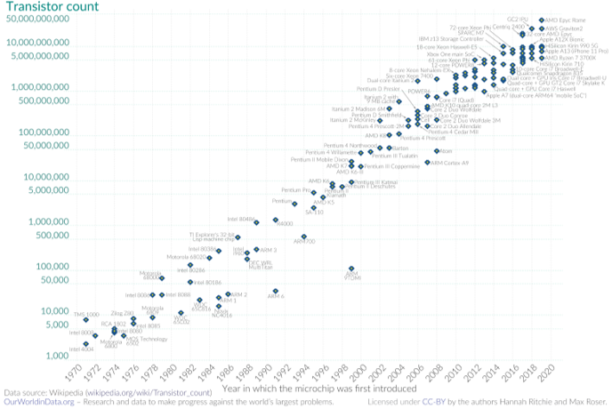
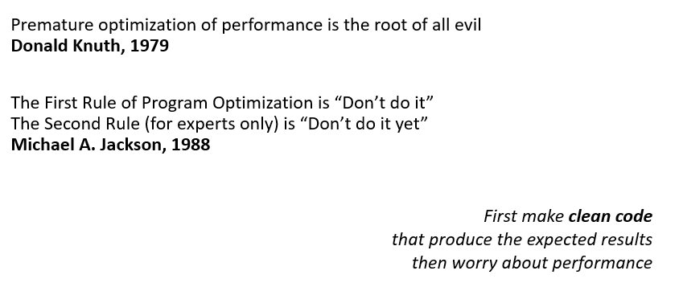

# Lectures – Monitoring and Performance Engineering

---

## Introduction

>*Programming is the art of telling another human being what one wants the computer to do.*
> Donald Knuth

## Brief Biography

Donald Ervin Knuth, born on January 10, 1938, in Milwaukee, Wisconsin, USA, is a computer scientist and professor emeritus at Stanford University, best known as the author of *The Art of Computer Programming*, one of the most influential works in the field. Knuth studied mathematics at Case Institute of Technology and earned his Ph.D. in mathematics from the California Institute of Technology (Caltech). Often referred to as the “father of algorithm analysis,” he pioneered many of the foundational methods for analyzing algorithm efficiency. He is also the creator of the **TeX** typesetting system and the **METAFONT** font design system, both of which revolutionized scientific publishing. His meticulous approach to computer science has inspired generations of researchers and programmers. Throughout his career, Knuth has received numerous honors, including the **Turing Award**, the **National Medal of Science**, and the **John von Neumann Medal**. He continues to work on later volumes of *The Art of Computer Programming* and maintains his commitment to the precision and beauty of computing.

### Improving Performance

The challenge of performance engineering lies in handling the increasing size and complexity of computations. Several strategies can help address this:

- **Faster processors:** Following Moore’s law, the number of transistors doubles approximately every two years, leading to faster chips. 

- **Parallelism:** Use multicore processors, GPUs, or clusters to execute computations simultaneously. 

- **Software optimization:** Adapt algorithms to take advantage of hardware and domain-specific structures. 

---

*Moore's Law: The number of transistors on microchips doubles every two years*

---

### Bentley’s Rules for Performance

Jon Bentley proposed four practical rules to improve program performance. Each focuses on simplifying and optimizing both problem and implementation.

**Code Simplification**  
Fast programs are simple. Keep code minimal and clean so that it is easier to optimize and maintain.  
*Key takeaway:* Simplicity enhances speed and reliability.

**Don't do it**
The fastest way to execute an operation is not to do it at all.
Often, part of the code performs unnecessary or repetitive tasks that can be eliminated.

*Example:* avoid redundant calculations inside loops, remove dead code, or prevent unnecessary disk or network accesses.

 Code Simplification

Imagine cooking a recipe with twenty unnecessary steps —every time you switch utensils or ingredients, you lose time and coordination.

If you simplify the recipe to the essential steps, you finish faster and make fewer mistakes.

<i>Cooking well and quickly means keeping only what’s truly needed.</i>

[Code Simplification](lectures_code.md#code-simplification)

**Problem Simplification**  
Simplify the problem itself before optimizing the code. Reducing complexity in the problem often yields a more efficient solution.  
*Key takeaway:* A simpler problem produces a faster solution.

**Do it, but don’t do it again**

If an operation must be done, store the result so it doesn’t need to be recalculated.
This is known as memoization or caching.
*Example:* store the results of an API query or an expensive function in memory.

 Problem Simplification

Suppose you need to organize a library. Instead of sorting all the books in the world by author and date, you decide to organize only the books you actually own.

By redefining the problem, you can move faster and get better results.

<i>Before solving a problem, make sure you’re solving the right one — and at the right scale.</i>

[Problem Simplification](lectures_code.md#problem-simplification)

**Relentless Suspicion**  
Question every instruction in time-critical code and every field in space-critical data structures.  
*Key takeaway:* Constantly verify the necessity of each operation.

**Do it less**

Reduce the amount of work performed.
Optimize loops, divide the problem, or use more efficient data structures.  
*Example:* replace a linear search (O(n)) with a binary search (O(log n)).

 Relentless Suspicion

Think about packing a suitcase for a trip. Every item you pack takes up space and adds weight. If you look critically (“Do I really need this?”), you’ll realize many things are unnecessary.

The lighter the suitcase, the easier it is to move and the less time you spend searching through it.

<i>Doubt everything that doesn’t add real value; lightness improves performance.</i>

[Relentless Suspicion](lectures_code.md#relentless-suspicion)

**Early Binding**  
Perform computations earlier to avoid redundant work later. Precomputing results or decisions saves time during execution.  
*Key takeaway:* Shift work forward when possible to minimize repetition.

**Do it better**

If something cannot be removed or reduced, do it more efficiently.
This involves using better algorithms or data structures, taking advantage of parallelism, or adapting the code to the hardware.  

*Example:* use a faster sorting algorithm, parallelize tasks, or vectorize operations.

 Early Binding

It’s like ironing your clothes right after washing them instead of every morning before leaving home.

You put in effort once, and then you benefit for days.

<i>Doing work early prevents having to repeat it later and keeps things flowing smoothly.</i>

[Early Binding](lectures_code.md#early-binding)

---

### Optimization Ethics

While performance optimization is crucial, it should not come prematurely. As two pioneers famously warned:

> *Premature optimization is the root of all evil.* — Donald Knuth  
> *The first rule of program optimization is “Don’t do it.” The second rule (for experts only) is “Don’t do it yet.”* — Michael A. Jackson

The goal of performance engineering is to first produce **clean and correct code** that behaves as expected. Only after correctness is guaranteed should optimization efforts begin.

---

Performance engineering, therefore, is not only about increasing speed but about **understanding**, **measuring**, and **refining** computation to achieve a sustainable balance between accuracy, clarity, and efficiency.

---

