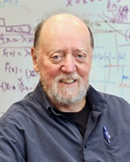

# Applications  -  Vector Programming

## Introduction

> *Performance improvements come from embracing parallelism, not avoiding it. — Jack Dongarra, (1950-)*  

## Brief Biography  

Jack Dongarra is an American computer scientist renowned for his foundational contributions to numerical linear algebra and high-performance computing. He led the development of key mathematical software libraries—including BLAS, LAPACK, and LINPACK—which remain essential to scientific computing and vectorized numerical workloads. Dongarra also co-created the TOP500 list, shaping how the world evaluates supercomputer performance. His work enabled scalable parallel computation and influenced modern GPU, multicore, and distributed architectures. In 2021, he received the ACM Turing Award for his profound impact on computational science.

---

Vector programming enables high-throughput computation by applying a single operation to multiple data elements simultaneously. Modern vector-capable architectures—including GPUs, vector supercomputers, and SIMD extensions in CPUs—make this model fundamental in many performance-critical domains.

---

## Scientific Computing

Scientific applications frequently involve operations that can be expressed as vector transformations on large datasets.

### Common Use Cases
- **Numerical linear algebra** (vector–matrix and matrix–matrix operations)  
  - Example: LU/QR factorizations, eigenvalue problems  
- **Finite-difference and finite-element simulations**  
  - Heat diffusion, fluid mechanics, wave propagation  
- **Molecular dynamics**  
  - Force computations over large particle sets  
- **Climate and weather modeling**  
  - Massive grid-based computations

### Why Vector Programming Helps
These workloads rely on repeated, homogeneous operations across large arrays—ideal for SIMD/SIMT execution.

**Reference:**  
NVIDIA CUDA Mathematical Libraries — https://developer.nvidia.com/gpu-accelerated-libs

---

## Machine Learning and Deep Learning

Deep learning is naturally vectorized. Most operations in neural networks are tensor transformations, allowing GPU tensor cores to deliver substantial throughput.

### Key Areas
- **Training deep neural networks** using large batches of data  
- **Inference acceleration** on GPUs and specialized hardware  
- **Matrix-heavy layers**  
  - Dense layers (GEMM)  
  - Convolutions (implemented via blocked matrix multiplications)  
  - Attention mechanisms in transformers

### Vector Programming Advantages
- High data parallelism  
- Efficient tensor operations  
- Hardware-supported mixed-precision computing

**Reference:**  
cuDNN: NVIDIA Deep Neural Network Library — https://developer.nvidia.com/cudnn

---

## Data Analytics and Big Data Processing

Big data workloads frequently involve operations performed over entire vectors or columns of datasets.

### Examples
- **Columnar processing in databases** (SIMD scans, selections, aggregates)  
- **Vectorized SQL engines** (e.g., Spark, DuckDB, ClickHouse)  
- **ETL pipelines** that transform large arrays of numeric or categorical data  
- **Statistical computations**  
  - Means, variances, correlations  
  - Histogramming and binning

### Benefits
- Reduced interpretation overhead  
- High memory bandwidth utilization  
- Efficient batch operations

**Reference:**  
Apache Arrow (columnar vector format) — https://arrow.apache.org/

---

## Computer Graphics and Image Processing

Graphics systems have historically been a primary driver of vector hardware development.

### Vector-Friendly Workloads
- **Image filters** (convolutions, edge detection, sharpening)  
- **Color space transformations**  
- **Geometric transformations** (scaling, rotation, translation)  
- **Real-time rendering pipelines**

### Why SIMD/SIMT Fits
Pixels, vertices, and fragments can be processed independently, making them ideal for vector pipelines.

**Reference:**  
OpenGL Shading Language (GLSL) — https://www.khronos.org/opengl/wiki/Core_Language_(GLSL)

---

## Signal and Audio Processing

Digital signal processing involves repetitive numerical operations over signals represented as vectors.

### Applications
- **Fast Fourier Transform (FFT)**  
- **Digital filters** (FIR, IIR)  
- **Spectral analysis**  
- **Audio synthesis and effects**

### Vectorization Gains
- Parallel computation of frequency bins  
- Highly regular memory access patterns  
- Repeated operations over contiguous segments of data

**Reference:**  
cuFFT: CUDA Fast Fourier Transform Library — https://developer.nvidia.com/cufft

---

## Computational Finance

Financial models often require large-scale simulation or evaluation of independent scenarios.

### Examples
- **Monte Carlo simulations** for pricing derivatives  
- **Risk analysis** (VaR, CVaR)  
- **Portfolio optimization**  
- **Stochastic differential equations**

### Advantages of Vector Programming
- Independence among simulation paths → highly parallelizable  
- Vector operations reduce time-to-solution in risk-critical computations

**Reference:**  
NVIDIA GPU Finance Applications — https://developer.nvidia.com/finance

---

## Bioinformatics and Computational Biology

Large biological datasets are inherently suitable for vector processing.

### Use Cases
- **Sequence alignment** (Smith–Waterman, Needleman–Wunsch)  
- **Genome assembly**  
- **Read mapping**  
- **Protein folding simulations**

### Vector Programming Impact
- Massive acceleration of pattern-matching kernels  
- SIMD implementations of scoring matrices  
- GPU-accelerated dynamic programming

**Reference:**  
NVIDIA Clara for Genomics — https://developer.nvidia.com/clara-genomics-analysis

---

## Summary

Vector programming enables high-performance computation across diverse application domains by:

- Applying uniform operations to large datasets  
- Leveraging SIMD/SIMT models for throughput  
- Exploiting specialized hardware (vector units, CUDA cores, tensor cores)  

Its broad range of use cases includes scientific computing, deep learning, analytics, graphics, signal processing, finance, and bioinformatics.

