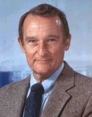

# Lectures  -  Vector Programming

## Introduction

> *“The trouble is that you can never know what a programmer is doing until it's too late.” — Seymour Cray (1925–1995)*   

## Brief Biography  

Seymour Cray was an American electrical engineer widely regarded as the father of supercomputing. He founded Cray Research in 1972 and designed groundbreaking systems such as the Cray-1, the first commercially successful vector supercomputer. His machines set performance records for decades and defined the architecture of high-speed scientific computing. Known for his minimalist design philosophy and extraordinary engineering intuition, Cray revolutionized parallel processing and high-performance systems. His legacy continues to shape modern supercomputers and HPC architectures.

---

Vector programming has its roots in the early era of supercomputing. Between the 1970s and 1990s, the term *supercomputer* was essentially synonymous with *vector machine*.  
The **Cray-1** (1976) is considered the first true vector supercomputer, revolutionizing numerical computing.

A **vector** is a set of scalar elements of the same type, and a **vector processor** is a hardware unit capable of applying operations to entire vectors rather than individual elements.

---

## Definition of a Supercomputer

Historically, a machine could be considered a supercomputer if it met at least one of the following:

- It cost more than **$30 million**  
- It was designed by **Seymour Cray**  
- It was capable of performing massive computations on large datasets  

In that era, vector machines were the dominant supercomputing architecture.

---

## Architecture of the Cray-1

The Cray-1 introduced the core concepts of vector architectures:

### Key Ideas
- Read sets of values into **vector registers**  
- Execute operations directly on these registers using **vector functional units**  
- Write results back to memory  

### Components
- **Scalar Unit**: handles traditional scalar operations  
- **Load/Store Architecture**: data moved explicitly between memory and registers  
- **Vector Registers**: fixed-length banks storing one full vector  
- **Vector Functional Units (VFUs)**: units performing arithmetic or logical vector operations  
- **Vector Load–Store Units (VLSUs)**: move full vectors to/from memory  

Typical machines included:
- 8–32 vector registers, each 64–128 bits  
- 4–8 VFUs supporting floating-point, integer, and logical operations  

---

## Vector Processing Styles

Vector machines fall into two architectural families:

### ● Memory–Memory Style
All vector operations read directly from memory and write back to memory.

### ● Register–Register Style
All vector operations occur between vector registers, except for explicit load/store operations.

The Cray-1 belongs to the register–register family.

---

## Flynn’s Taxonomy

Vector machines fit into a broader classification of parallel architectures:

- **SISD — Single Instruction, Single Data**  
- **MISD — Multi-Instruction, Single Data**  
- **SIMD — Single Instruction, Multiple Data**  
- **MIMD — Multi-Instruction, Multiple Data**

Vector processors are tightly related to **SIMD**, since the same instruction operates on multiple data elements.

---

## SIMD vs. MIMD

### SIMD (Single Instruction, Multiple Data)
- All threads share the same program counter  
- Common in GPUs and vector processors  

### MIMD (Multiple Instruction, Multiple Data)
- Each thread executes independently with its own program counter  
- Typical in multicore CPUs  

---

## Execution Efficiency and Branch Divergence

In SIMD or SIMT environments, **divergent branches** reduce performance:

- When threads take different control paths, only one path is active at a time  
- Inactive branches stall, reducing effective parallelism  

**Branch Efficiency Formula:**

\[
\text{Branch Efficiency} = \frac{\#\text{branch executions} - \#\text{stall executions}}{\#\text{branch executions}}
\]

Loss of efficiency due to divergence is a key concern in vector-oriented hardware such as GPUs.

---

## Modern Vector Machine Design

Modern vector and GPU architectures follow a shared philosophy:

- Large numbers of simple compute units  
- High throughput rather than low latency  
- A programming model that exposes data parallelism  
- Execution based on **kernels**:

### Kernels
- Written as if running on a single processing element  
- Executed by many instances across multiple data elements  

---

## GPU Programming Models

Several frameworks exist to program GPU-based vector architectures:

- **CUDA (Compute Unified Device Architecture)**  
- **DirectX (Microsoft)**  
- **OpenGL**  
- **OpenCL**  
- **Vulkan**

CUDA is the most widely used model for high-performance computing.

---

## CUDA Programming Model Overview

A CUDA program involves the interaction between:

- **Host (CPU)**  
- **Device (GPU)**  
- **Host memory**  
- **Device memory**

### Execution Steps
1. Host copies data and kernels to the device  
2. Host launches kernels  
3. Kernels execute in parallel on the GPU  
4. Host waits for completion  
5. GPU sends results back to host memory  

---

## CUDA Compilation Pipeline

CUDA source files pass through multiple stages:

- `.c` → CUDA C source  
- `.ptx` → PTX assembly  
- `.cubin` → binary executable for the GPU  

The `nvcc` compiler orchestrates all stages.

---

## CUDA Execution Model

When a kernel is launched:

- A **grid** of *thread blocks* is created  
- Each block contains a multiple of **32 threads** (warps)  
- Threads have unique `thread-id`s; blocks have unique `block-id`s  

### Memory Hierarchy
- Registers  
- L1 cache  
- L2 cache (shared across SMs)  
- Global memory  
- Shared memory (per block)

Threads within a block can communicate via shared memory; threads across blocks communicate only via global memory.

### Execution Units
- **CORE** executes threads  
- **SM (Streaming Multiprocessor)** executes blocks  
- **Warp** (32 threads) executes in **SIMD** mode  
- GPUs implement **SIMT (Single Instruction Multiple Threads)** semantics

---

## Summary

Vector programming underpins the architecture of both classical supercomputers and modern GPUs.  
Its key traits—vector registers, SIMD execution, warp-level parallelism, and efficient memory hierarchies—form the foundation of high-throughput computing in contemporary systems.

