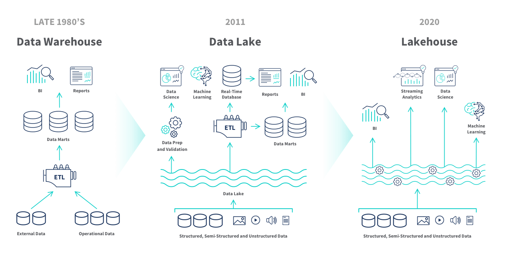

# Introduction to Big Data  
*A new era of data-driven innovation*

---

## From Early Computing to the Digital Revolution

The journey of Big Data starts with the evolution of computing itself:

- **1950s**: John von Neumann formalized computer architecture, setting the basis for digital computation. At the same time, advances in **numerical algorithms** and **game theory** influenced how data and complexity would be modeled.  
- **1960s–1970s**: Paul Eisler’s printed circuit boards and John Bardeen’s transistor discoveries paved the way for miniaturization. Jack Kilby’s microchip and Douglas Engelbart’s vision of interactive computing changed how people interacted with technology.  
- **1980s–1990s**: Ted Nelson conceptualized **hypertext**, Robert Metcalfe created **Ethernet**, and Tim Berners-Lee at CERN invented the **World Wide Web**, democratizing access to global information. Alan Kay and Engelbart further advanced the idea of graphical user interfaces (GUI).  
- **2000s**: Complex systems modeling, network growth, and ubiquitous devices fueled an explosion of data that set the stage for the **Big Data era**.

*Big Data era*
---

## The Convergence of Statistics and Artificial Intelligence

Big Data analytics is powered by advances in **mathematics, statistics, and AI**:

- **Thomas Bayes**: Introduced probabilistic reasoning, enabling decision-making under uncertainty.  
- **Geoffrey Hinton**: Pioneered **deep learning**, with neural networks that can process speech, images, and language at scale.  
- **Richard Sutton**: Advanced **reinforcement learning**, allowing systems to learn by trial and error, simulating real-world decision-making.  

Together, these approaches transformed massive datasets into knowledge and actionable insights.

---

## What Is Big Data?

Big Data refers to datasets that are too large, fast, or diverse to be managed by traditional methods. Its defining characteristics are often expressed as the **5Vs**:

- **Volume**: massive quantities of data.  
- **Velocity**: real-time or near real-time data flows.  
- **Variety**: text, images, video, audio, and sensor data.  
- **Veracity**: ensuring accuracy and reliability.  
- **Value**: extracting useful insights for decision-making.  

### How big is “Big”?  
An **exabyte (EB)** equals one million terabytes (TB). For example:  
- **40 EB = 40,000 PB = 40,000,000 TB = 40,000,000,000 GB**.  
This unimaginable scale is equivalent to millions of modern hard drives, highlighting the storage and processing challenges of Big Data.

---

## Big Data Architectures

- **Data Lake**: Centralized repository that stores raw, unstructured, and semi-structured data. Highly flexible, but lacks governance and fast querying.  
- **Data Warehouse**: Structured, schema-based system optimized for analytics and business intelligence (BI). Enforces **ACID** transactions and strong data consistency.  
- **Data Lakehouse**: Hybrid architecture combining the scalability of lakes with the reliability of warehouses. Supports both raw and structured data, ACID compliance, and efficient queries.  

The **Lakehouse** approach is becoming the standard in modern Big Data platforms.

---

## Highlights of Big Data in the 21st Century

Recent and emerging trends shaping Big Data include:

1. Rise of **cloud-native Big Data solutions**.  
2. **Real-time data processing** at scale.  
3. **Privacy and governance** as central challenges.  
4. **Edge computing** for localized analytics.  
5. Integration of **AI and machine learning** into data platforms.  
6. Big Data applications in **healthcare and medicine**.  
7. **Data democratization** and self-service analytics.  
8. **Data lakes** and **lakehouses** as dominant architectures.  
9. Advances in **Natural Language Processing (NLP)** for text and speech.  
10. **Quantum computing** as a future enabler of large-scale analytics.  
11. Big Data for **sustainability and climate change**.  
12. **Data Fabric and Data Mesh** architectures for decentralized governance.  

---

## The Impact of Big Data on Society

Big Data influences multiple aspects of daily life and industry:

- **Spam and fraud detection**.  
- **Recommender systems** powering e-commerce and entertainment.  
- **Emotional AI** analyzing human sentiment.  
- **Sensorization and IoT** for smart cities, vehicles, and health.  
- **Video analysis** for security, transport, and medical imaging.  

*Spam*

*Fraud*

*Emotional Intelligence*

*Sensorization*

*Recommendation systems*

These applications show Big Data’s power to deliver innovation, while also raising challenges of **ethics, privacy, and fairness**.

---

## Why Study Big Data?

By the end of this course, students will be able to:

- Design **scalable and distributed systems**.  
- Implement **parallel programming and data-intensive algorithms**.  
- Integrate **machine learning and AI** into Big Data workflows.  
- Address **social and ethical challenges** in the use of large-scale data.  

**Big Data is not only about technology** — it is about shaping the future of science, business, and society in a data-driven world.

---
